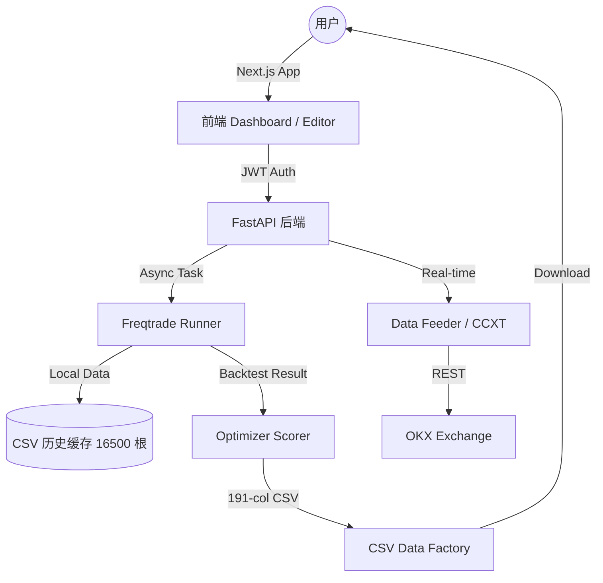

# ⚡ BTC Station: 专业级比特币量化投研平台 (Technical Whitepaper)

BTC Station 是一个专为比特币 (BTC) 量化交易打造的私有化、高性能闭环系统。它不仅复刻了 TradingView 的交互体验，更在底层集成了 **VectorBT** 与 **Freqtrade** 双引擎，实现了从“实时情报获取”到“AI 启发式调参”再到“工业级回测”的全链路覆盖。

|我觉得我应该先和你交代好项目。顺便请你帮我分析项目的挣钱能力。
第一，我这是一个只专注比特币的网站，首页有很全面的比特币信息，新闻等。
第二，可以使用简单的策略进行回测，像TV一样，可以显示出回测结果，可视化。
第三，可以自动换参数，像Tradingview assistant这个插件一样，可以用退火法等，选择参数
第四，Tradingview assistant选择参数后，可以得到一个CSV文件。请了解下Tradingview assistant开源项目，然后用https://quant-lab.org/来分析CSV文件，得到最佳结果。

---

## 💎 五大核心功能模块深度解析

### 1. BTC 全域情报中枢 (The Insight Hub)
不仅仅是行情显示，更是一个深度集成的数据同步中心：
*   **16,500 根 K 线预载逻辑**：系统启动时，`DataFeeder` 会通过 CCXT 自动同步 BTC/USDT 在 `1h/4h/1d` 三个核心周期的全量历史数据（每周期达 16,500 根），确保回测时无需等待网络下载。
*   **智能增量更新算法**：采用“分级抓取”策略。如果本地缓存已存在 80% 以上的数据，系统仅抓取最新的 100 根 K 线进行 `drop_duplicates` 合并，极大地降低了交易所 API 频率占用。
*   **多源情报聚合**：整合实时新闻流、OKX 订单流深度指标以及趋势预警，打造信息密度极高的交易员工作台。

### 2. 类 TradingView 级交互工作空间 (Analysis Workspace)
依托 `Lightweight Charts` 打造的极速交互体验：
*   **双引擎回测架构**：
    *   **Lightweight 引擎 (VectorBT)**：利用 Numpy 矩阵运算，在前端修改参数时，后端可实现 **< 500ms** 的响应，支持参数变动时的即时曲线反馈。
    *   **Professional 引擎 (Freqtrade)**：支持用户编写复杂的 Python `IStrategy` 类，进行包含杠杆、手续费及资金费率的精确回测。
*   **买卖 Marker 标注**：回测产生的每一笔交易都会在图表上以箭头标识，点击即可查看该笔交易的入场价、出场价及盈亏百分比。

### 3. Freqtrade 策略实验室 (Pro Strategy Lab)
将工业级回测引擎搬入浏览器：
*   **Monaco Editor 高级定制**：支持 Python 语法高亮、自动缩进及 Freqtrade 常用库（talib, pandas-ta）的智能补全。
*   **多租户隔离与安全**：每个用户的回测任务都在独立的进程空间运行，通过 `PLAN_LIMITS` 严格限制资源配额（免费用户 512MB 内存/0.5 核 CPU；Pro 用户 2GB 内存/2 核 CPU）。
*   **WebSocket 日志流**：通过 WS 协议将 Freqtrade 的实时运行日志直接推送到前端控制台，用户可实时观察策略的加载与执行进度。

### 4. 智能启发式调参集群 (High-Performance Optimizer)
复刻并超越 TradingView Assistant 插件的调参能力：
*   **算法支持**：内置 **模拟退火算法 (Simulated Annealing)**、**粒子群优化 (PSO)**、**随机搜索** 及 **网格穷举**，旨在从成千上万种参数组合中寻找局部最优解。
*   **双重数学评分模型**：
    *   **Utility Score (收益效用)**：综合 `Total Profit * 0.5 + Win Rate * 0.3 + Activity * 0.2`。
    *   **Robustness Score (稳健性评分)**：根据最大回撤进行惩罚，回撤超过 30% 将面临断崖式扣分。
*   **191 列专业 CSV 导出**：导出完全符合 TV Strategy Tester 标准的 191 列 CSV（UTF-8 BOM 编码），直接兼容量化分析软件。

### 5. Quant-Lab.org 生态闭环
系统生成的 CSV 矩阵是 [quant-lab.org](https://quant-lab.org/) 的核心输入源：
*   **稳健性筛选**：在 quant-lab 中对参数进行稳定性测试，剔除由于“随机性”导致的虚假高收益。
*   **部署决策**：通过 quant-lab 的 87 分评分标准，锁定最终实盘运行的参数集。

---

## 📁 模块化代码导图 (Granular Code Guide)

### 📂 btc-station/ (Next.js 前端)
*   `app/page.tsx`: **数据大屏入口**。协调 `fetchSummary`, `fetchKlines`, `fetchNews` 三大异步流，实现仪表盘联动。
*   `app/strategies/editor/`: **策略开发核心**。集成 Monaco Editor 实例，管理回测任务的状态机（Pending -> Running -> Completed）。
*   `components/PriceCard.tsx`: **K 线动态渲染器**。封装了 Lightweight Charts 逻辑，处理实时价格跳动与历史切片展示。
*   `lib/supabase/`: **持久化层**。管理用户策略代码、回测历史记录以及 JWT 鉴权令牌。

### 📂 backend/ (FastAPI 后端)
*   `main.py`: **系统大脑**。启动时通过 `lifespan` 机制触发后台数据同步线程，并挂载 V3.1 业务路由。
*   `freqtrade_runner.py`: **任务编排器**。动态生成 Freqtrade 配置文件（config.json），通过 `subprocess` 安全调用引擎并解析 JSON 结果。
*   `data_feeder.py`: **数据泵**。底层使用 CCXT 与交易所通信，实现带分页保护的 K 线抓取与本地 CSV 缓存管理。
*   `api_v31.py`: **业务中枢**。实现基于 JWT 的用户配额校验（Quota Control）、策略 CRUD 以及回测任务的异步分发。
*   `optimizer/scorer.py`: **评分算法模块**。实现前述的 Utility/Robustness 逻辑，将原始交易数据转化为百分制得分。
*   `csv_converter.py`: **标准化工厂**。将 Freqtrade 的复杂 JSON 嵌套格式扁平化为 191 列标准 CSV 格式。

---

## ⚙️ 系统架构图 (Architecture)

---

## 🛠️ 技术规格 (Technical Specs)
*   **前端**: Next.js 14, Tailwind CSS, TypeScript, Lightweight Charts, Monaco Editor.
*   **后端**: FastAPI, Pandas, Numpy, Freqtrade stable, CCXT.
*   **基础设施**: Supabase (Auth/Postgres), Redis (Cache), Celery (Task Queue), Railway/Vercel.

---

## ⚠️ 风险免责声明 (Disclaimer)
本项目仅供量化技术研究与学习使用。金融市场具有极端高风险。使用此系统的任何真实资金交易，风险由使用者 100% 自行承担。
�代码地图 (File System Guide)

### 📂 根目录 (Project Root)
*   [README.md](file:///c:/Users/GAKU/Desktop/BTC%20Tradingview%20assistant/README.md): 本文档，系统全景图。
*   [task.md](file:///c:/Users/GAKU/Desktop/BTC%20Tradingview%20assistant/task.md): 动态任务跟踪器，记录当前开发阶段。
*   `Phase-x.x-实施策划书.md`: 存放各阶段深度设计的详细执行文档。

### 📂 btc-station/ (Next.js 前端)
*   `app/page.tsx`: **看板主页**，负责新闻、实时价格与迷你图的编排。
*   `app/strategies/editor/`: **策略编辑器**，集成代码编辑与回测控制台。
*   `components/PriceCard.tsx`: **价格核心组件**，处理 K 线与实时波动的渲染。
*   `components/NewsFeed.tsx`: **新闻流组件**，处理情报抓取。
*   `supabase_schema.sql`: 数据库结构定义，涵盖用户、策略与回测记录。

### 📂 backend/ (FastAPI 后端)
*   `main.py`: **后端入口**，处理 API 路由分发与系统启动自检。
*   `freqtrade_runner.py`: **容器编排引擎**，负责动态启动 Freqtrade 执行用户策略。
*   `data_feeder.py`: **数据同步器**，在后台异步预载 BTC 5 年历史数据。
*   `api_v31.py`: **V3.1 业务路由**，负责策略 CRUD、WS 进度推送与 CSV 下载。
*   `dynamic_runner.py`: **动态执行引擎**，用于快速运行用户提交的 Python 代码块。
*   `optimizer/scorer.py`: **评分逻辑**，实现类似 quant-lab 的稳健性打分算法。

---

## 🛠️ 技术架构 (Architecture)
*   **前端**: Next.js 14 (App Router), Tailwind CSS, Lightweight Charts.
*   **后端**: FastAPI, Freqtrade (Dockerized), Celery, Redis.
*   **基础设施**: Vercel, Railway, Supabase (Auth/DB/Storage).

---

## ⚠️ 风险免责声明 (Disclaimer)
本项目仅供量化技术研究与学习使用。金融市场具有极端高风险，实盘发单引擎的代码可能因为网络延迟、交易所接口变动或策略漏洞导致严重亏损。使用此系统的任何真实资金交易，风险由使用者 100% 自行承担。强烈建议在实盘前使用少量资金或测试网 (Testnet) 进行充分验证。
