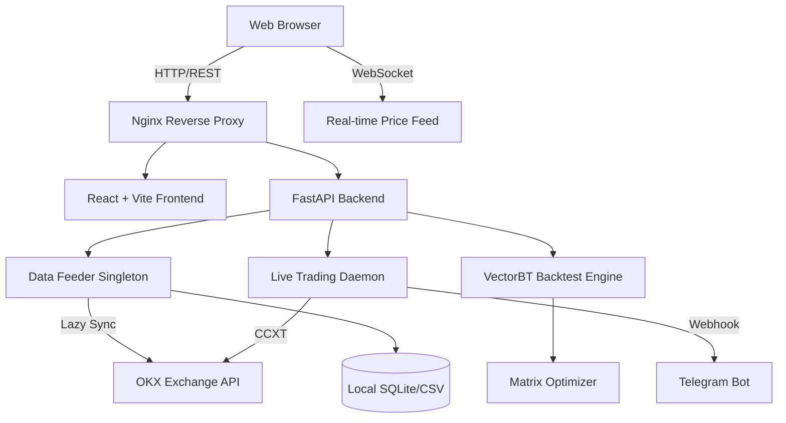

# 🏛️ Quant Lab - SaaS 架构规范 (v2.0)

## 一、 系统架构图

## 二、 核心技术决策与原则 (3-Option Rule)

### 1. Python 策略执行安全
* **选定方案**：模板化参数配置 (无代码模式) 作为 MVP，后续向 WebAssembly (Pyodide) 演进。
* **原因**：为了尽快上线并彻底阻断 RCE（远程代码执行）漏洞，初期屏蔽外部用户的自定义代码编写入口。内置成熟模板（如海龟、均线），仅开放参数调整。

### 2. 多用户并发下的数据获取
* **选定方案**：中心化 Lazy Sync (单例缓存)。
* **原因**：如果 100 个用户并发请求 16,500 根数据，直接请求 OKX 会被瞬间封禁。架构必须改为服务器在启动时一次性拉取 16,500 根数据，并驻留在 `Pandas DataFrame` 内存中。所有用户的请求直接从内存读取（耗时 < 10ms）。服务器每隔 5 分钟在后台静默更新最新数据。

### 3. 前端工程拆分
* **选定方案**：React Router 多页面架构。
* **路由设计**：
  * `/` -> `HomePage`: 营销落地页、实时新闻 (CryptoPanic)、24小时缩略图、最新价格。
  * `/workstation` -> `WorkstationPage`: 专业级图表、回测工具、参数寻优器。

## 三、 数据字典与 API 契约

### 1. `GET /api/data`
* 从全局内存缓存中极速返回数据，不再阻塞等待 OKX 响应。

### 2. `POST /api/backtest/dynamic`
* 接收预置的策略标识与参数集合，阻断恶意 `eval`/`exec` 调用。

### 3. `POST /api/optimize`
* 接收网格搜索参数，返回给前端或直接对接 `quant-lab.org` 的 CSV 接口。
